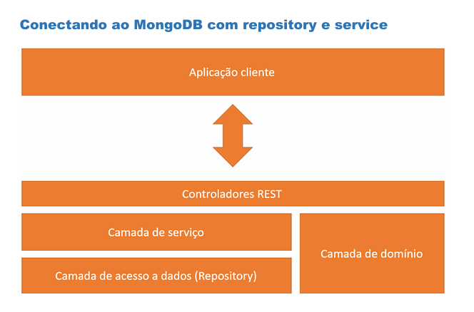
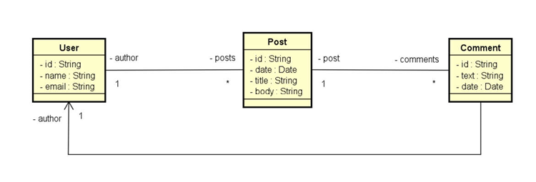

# 📘 API REST com Spring Boot e MongoDB
Uma API RESTful simples construída com Spring Boot e MongoDB. Este projeto simula um sistema de postagens com usuários e comentários.

# 🎓 Sobre o Projeto
Este projeto foi desenvolvido como parte do curso "Java COMPLETO - Programação Orientada a Objetos + Projetos" do professor Nélio Alves.

O objetivo é praticar conceitos de Spring Boot, MongoDB e construção de APIs RESTful com boas práticas.

# 💻 Tecnologias
#### ☕ Java 17
#### 🚀 Spring Boot 3.5.0
#### 📦 Spring Data MongoDB

# Banco de Dados
🗄️ MongoDB

# Ferramentas
#### 🔧 Maven 3.9.0
#### 📚 Spring Web
#### 🧪 Spring Boot DevTools

# 🗂️ Modelo de Domínio
Usuários podem criar posts e cada post pode conter comentários. Os dados são armazenados em documentos no MongoDB.

# 🛣️ Endpoints da API

## 👥 Usuários
| Método | Endpoint      | Descrição               | Códigos de Status |
| ------ | ------------- | ----------------------- | ----------------- |
| GET    | `/users`      | Lista todos os usuários | 200, 500          |
| GET    | `/users/{id}` | Busca usuário por ID    | 200, 404, 500     |
| POST   | `/users`      | Cria um novo usuário    | 201, 400, 500     |
| PUT    | `/users/{id}` | Atualiza um usuário     | 200, 404, 500     |
| DELETE | `/users/{id}` | Remove um usuário       | 204, 404, 500     |

## 📝 Postagens
| Método | Endpoint                                                           | Descrição                                  | Códigos de Status |
| ------ | ------------------------------------------------------------------ | ------------------------------------------ | ----------------- |
| GET    | `/posts/{id}`                                                      | Busca post por ID                          | 200, 404, 500     |
| GET    | `/posts/titlesearch?text=abc`                                      | Busca posts por título contendo texto      | 200, 404, 500     |
| GET    | `/posts/fullsearch?text=abc&minDate=2020-01-01&maxDate=2023-01-01` | Busca posts por texto e intervalo de datas | 200, 500          |

# 📂 Estrutura do Projeto
src/
├── main/
│   ├── java/
│   │   └── com/matheusHolanda/workshopMongo/
│   │       ├── config/
│   │       ├── controllers/
│   │       ├── domain/
│   │       ├── dto/
│   │       ├── repository/
│   │       ├── services/
│   │       └── Application.java
│   └── resources/
│       ├── application.properties
│       └── static/
└── test/
└── java/
└── com/matheusHolanda/workshopMongo/

# ⚙️ Configuração do Banco de Dados
### No arquivo application.properties:
spring.data.mongodb.database=workshopmongo
spring.data.mongodb.port=27017
spring.data.mongodb.host=localhost

# ⭐ Funcionalidades
#### 👥 Gerenciamento de usuários
#### 📝 Criação de postagens com autores e comentários
#### 📅 Busca por data e por título
#### 🔍 Decodificação de parâmetros de URL
#### 🔁 Relacionamentos entre documentos (User ↔ Post ↔ Comment)

# Camadas de serviço

# Modelo conceitual

# 🚀 Primeiros Passos
### Pré-requisitos
#### ☕ Java 17
#### 🔧 Maven
#### 🧩 MongoDB instalado (ou conta no MongoDB Atlas)

### Instalação
git clone https://github.com/MatheusP4ssos/workshop-spring-boot-mongoDB.git
cd workshop-spring-boot-mongoDB
mvn clean install
mvn spring-boot:run

### 🧪 Testes
mvn test

# 📚 Aviso Educacional
Este projeto foi desenvolvido com fins educacionais como parte do curso "Java COMPLETO - Programação Orientada a Objetos + Projetos" do professor Nélio Alves.
Não se trata de um produto oficial ou comercial relacionado ao curso ou ao autor.

# 👤 Autor
Matheus Holanda Passos

# 📞 Suporte
#### 📧 Abra uma issue no repositório
#### 🌟 Dê uma estrela se gostou do projeto
#### 🔄 Contribua com um pull request
